# 谈谈我和北京房地产黑中介的交手经历

> 10 月初，我收到了后厂村某互联网公司的实习 offer。彼时距离开始实习已经没有几天了，于是我立刻开始寻找房源。一开始我在自如上搜房。但是，经人提示，其他平台上可以租到更廉价的房子。于是我打开了安居客，在这里我遇到了这个中介。我的噩梦也开始了。

## 一些背景

11 月 22 日凌晨，我按照合同给中介转钱，结清了到明年 2 月的房租。（合同也只定到明年 2 月）

11 月 22 日下午，“房东”叫我舍友拉了一个群，把我也拉了进去。当晚，在我和我妈的电话里我说：刚转完钱又找我，他们肯定是要开始整活了。

## “他们又开始整活了”

3 天后的中午，我和同事一起，去西二旗地铁站附近的商场吃午餐。刚到餐厅，还来不及点餐，我就收到了“房东”的催租信息。

这是一条语音信息，“房东”说：“住那儿的哥们，这两天房租要不交的话，你就搬走吧。然后我就让人直接找你去吧。你房租要再拖的话就没意义了。”

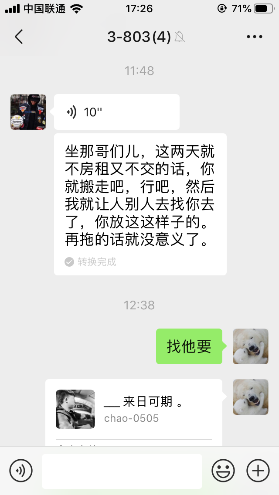

我把中介的微信推给他，告诉他：“我给他一万了，有合同，如果他不给你，走法律程序。”

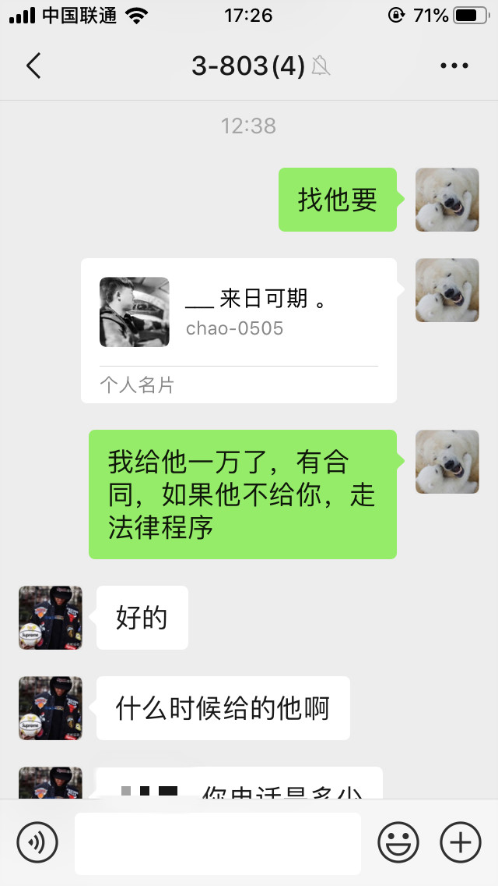

然后他就开始表演，首先是奇葩言论：

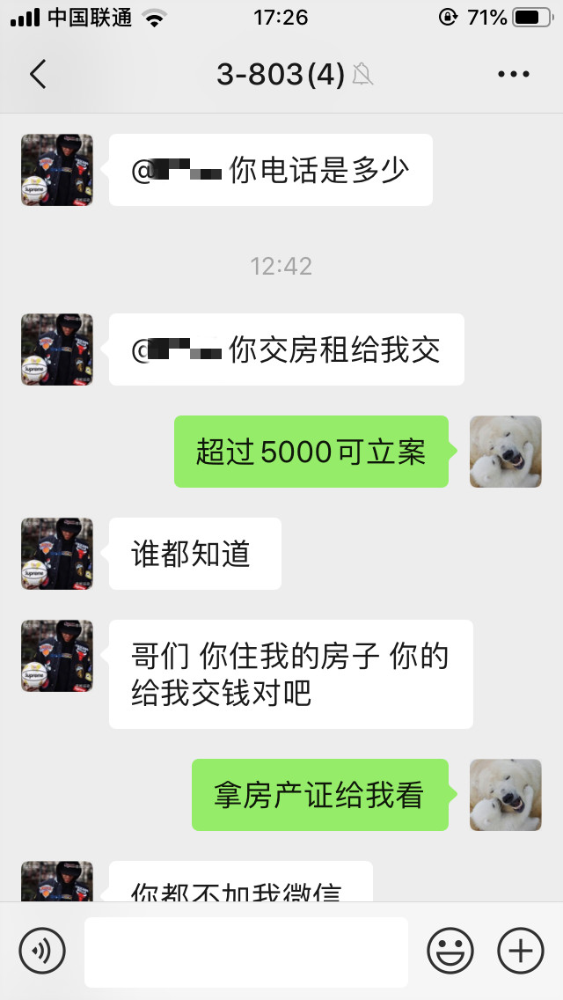

我来划划线：

<u>你交房租给我交</u>

<u>你住我的房子 你的给我交钱对吧</u>

凭什么是给你交？我当然是按合同来，按合同上的规矩交。

当初合同上写的是中介的支付宝账号。现在我刚给中介打完钱，这还没三天，“房东”就变换说法，要我重新给他打钱？凭什么？

接着，“房东”就开始威胁我，说：“今天晚上就让人找你去”，“你别在这房子里住”，“你问问你们室友我是什么角色”：

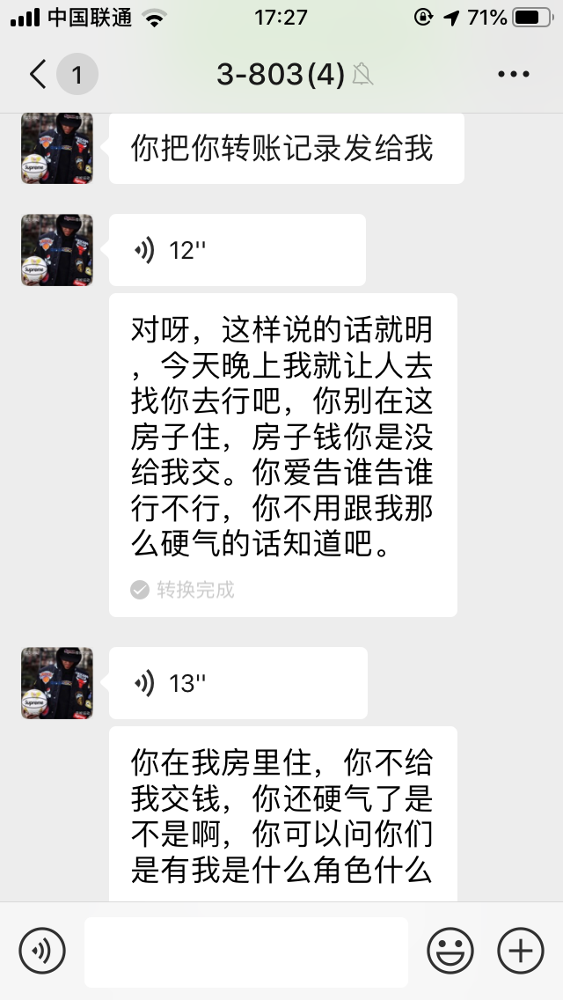

既然他敢威胁我，我就要去报案：

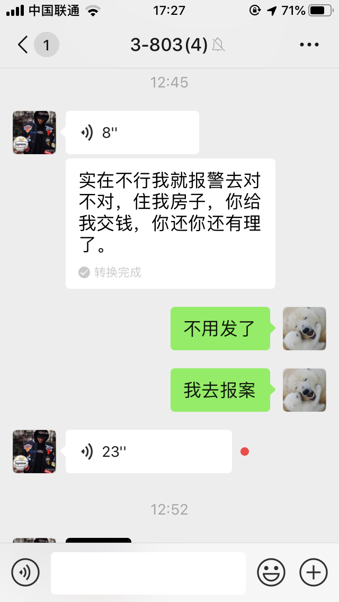

听说我要报案以后，“房东”就怂了。

忙不迭地就发了这么一张图给我：

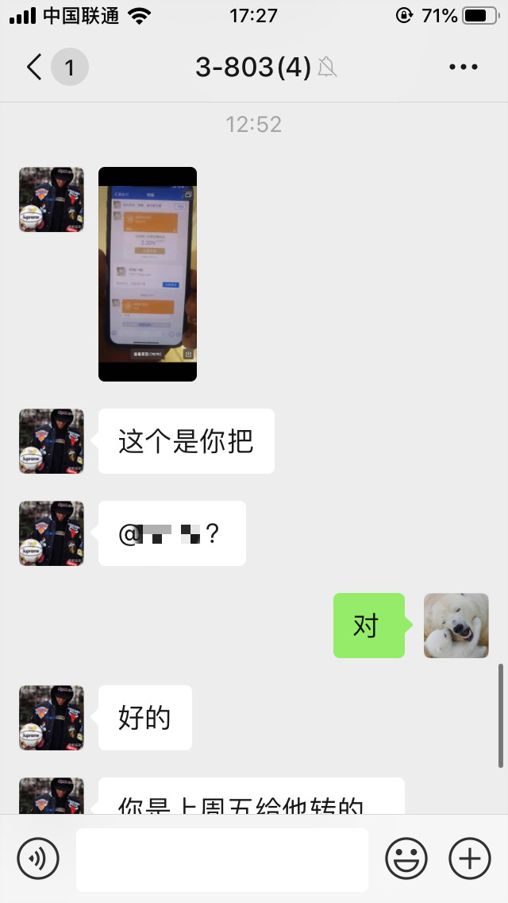
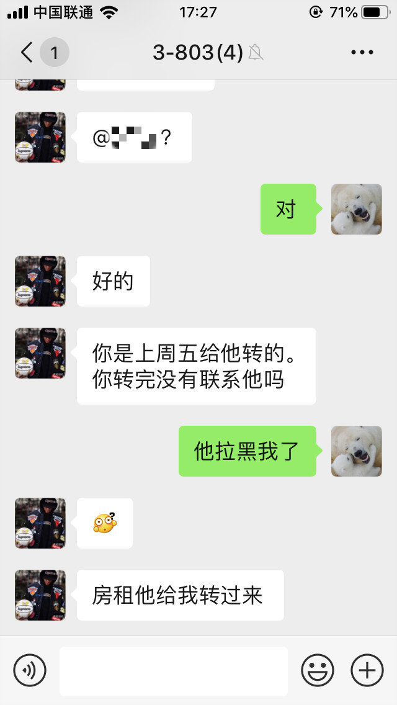

看看这速度。从我声明要报案到他发图，中间隔了不到七分钟。然后“房东”就返了一张站在中介身边，拍中介手机的图。

那我是不是可以合理怀疑他们俩根本就是一伙的。这么快就聚在一起，晚上怕不是屁股挨着屁股睡的。

事后还要假惺惺地问我为什么打完钱没跟中介说。

当然没法跟中介说啊，因为打完钱以后中介就拉黑我啦：

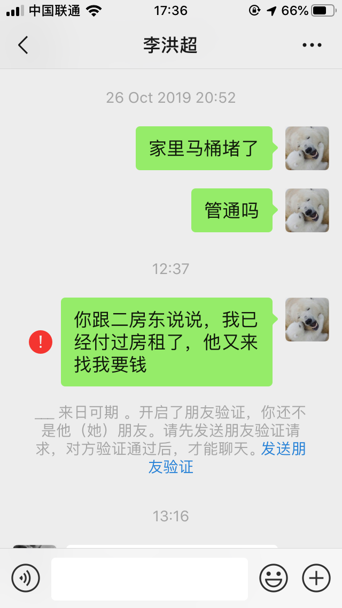

## 前传

呵呵，这并不是这他们第一次骗我。在此之前，他们已经试图骗过我两次了。

第一次，黑中介骗我说房子是包水电、暖气、清洁费、修理费的，让我付1800。一开始我不愿意交，他推说舍友都交了，我必须交。我没办法，只能交了。入住以后询问舍友，才知道所谓水电、暖气、清洁费、修理费，一项也没有，全是骗人的。

第二次，他推说“房东”不肯租给我了，要我加钱才能继续租。就是这次我妈和“房东”进行了交涉，才有了前文“房东”说曾和我妈交谈过那件事。不过这次我长见识了，没有上当。

但是，无论是第一次向我收取并不存在的服务费，还是第二次的刻意找茬，都属于软骗。我万万没想到，黑中介和“房东”居然可以通过人身威胁的方式硬骗。

## 总结

避免被骗的最好的办法就是擦亮眼睛，远离黑中介。

初次见面，黑中介就像刚骗到小姑娘的男人一样谄媚，温暖和殷勤。但是千万不要被这些表象迷惑，更不要因此就把信任托付给他们。他们表现出这种面目的真实目的是要骗你的钱。

如果你已经和黑中介接触，甚至走到了合同这一步，都没关系。只要没签字没给钱，都不是大问题。

如何在签合同时，识别对方是否是黑中介呢？下面是我这次悲催经历给我的一点经验：

- 一定要注意合同上那些拿笔直接划掉的选项，那是黑中介再为骗钱留伏笔。（比如当时我的合同上水电，暖气一栏就被一笔划掉。我还问他为什么只划一笔。他含含糊糊地说就是你们该怎么付就怎么付。等签完合同以后，就开始忽悠。当时所说的该怎么付，就完全由他来定义。）
- 一定要在问清是否有中介费。以及中介费是由租客自己承担，还是由房东和租客共同承担。
- 一定要要求中介带你去机构签，而非在私下的场合签约。（这一点我做到了，我当时和中介去了北京龙腾街上的房天下签的合同，带我去了一间会议室，并自称该公司经理。但是从合同上的公章以及他的所作所为来看，他不太可能是房天下的员工。只是和那里的人熟悉。所以在哪里签这个问题并不是太重要，推诿的办法太多太多，还是要看合同上的公章。）
- 一定要注意合同上的公章，上面的公司是否真实存在。（我后来用天眼查查了一下合同上的企业，发现该企业并不存在。）

<b>完整聊天记录</b>

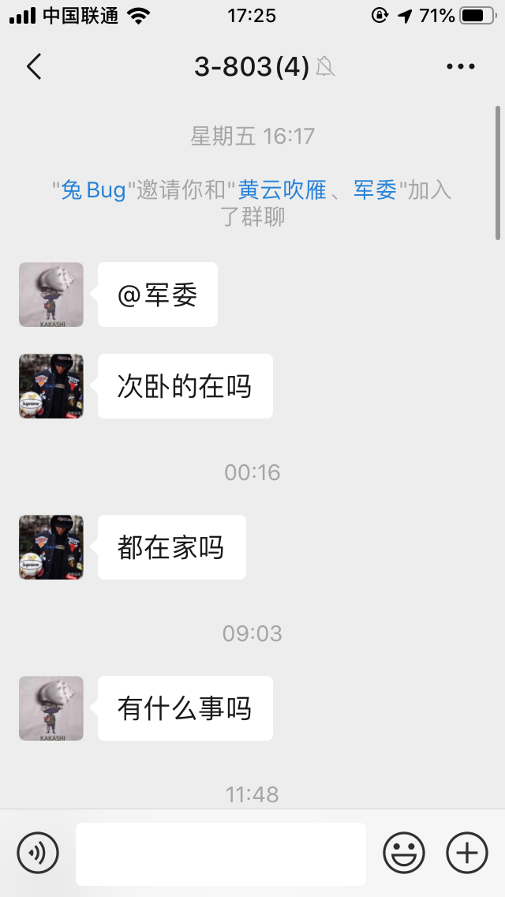

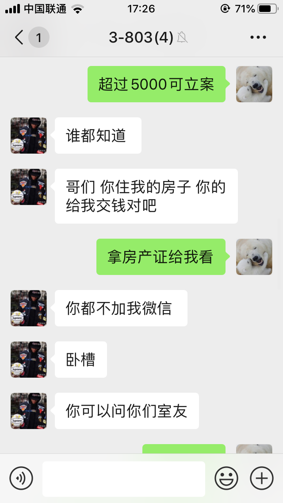
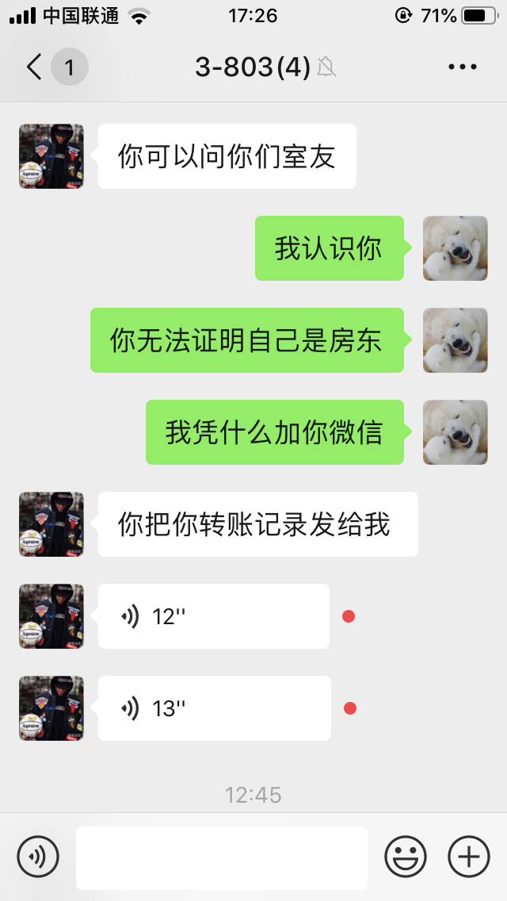
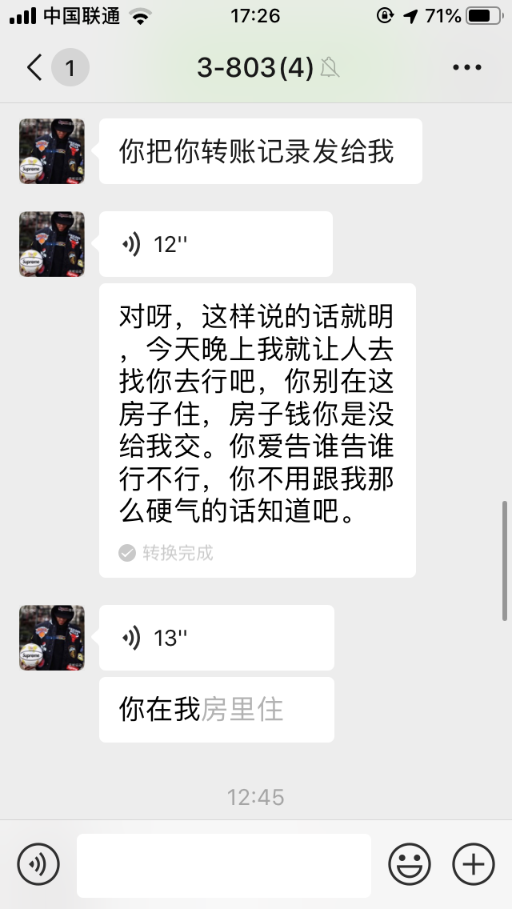

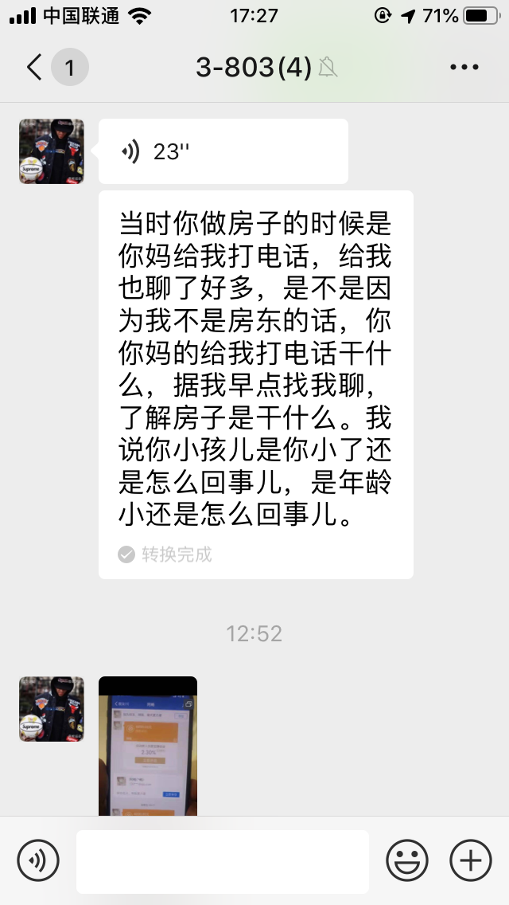

注：我妈是根据合同上房东那一栏留的电话信息找到他的，但谁也没见过房产证，谁知道他是不是房东？

